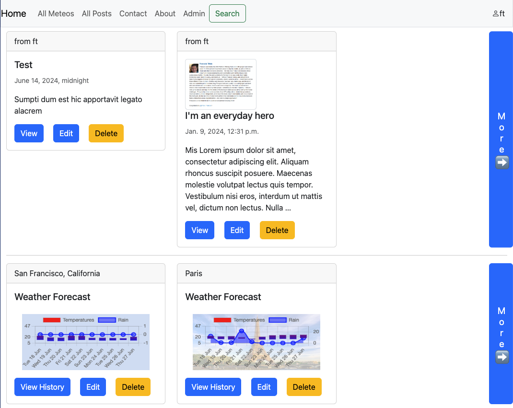

# Django and Python Exploration

1 Blog management application, with search queries ("hello world")
2 Weather history and prediction application  
  - Based on opencagedata.com geolocation and weather data
  - Includes map from OpenStreetMap
  - Includes charts
  - User profile to manage history and prediction duration
  - Also uses chart.js, JQuery and Bootstrap