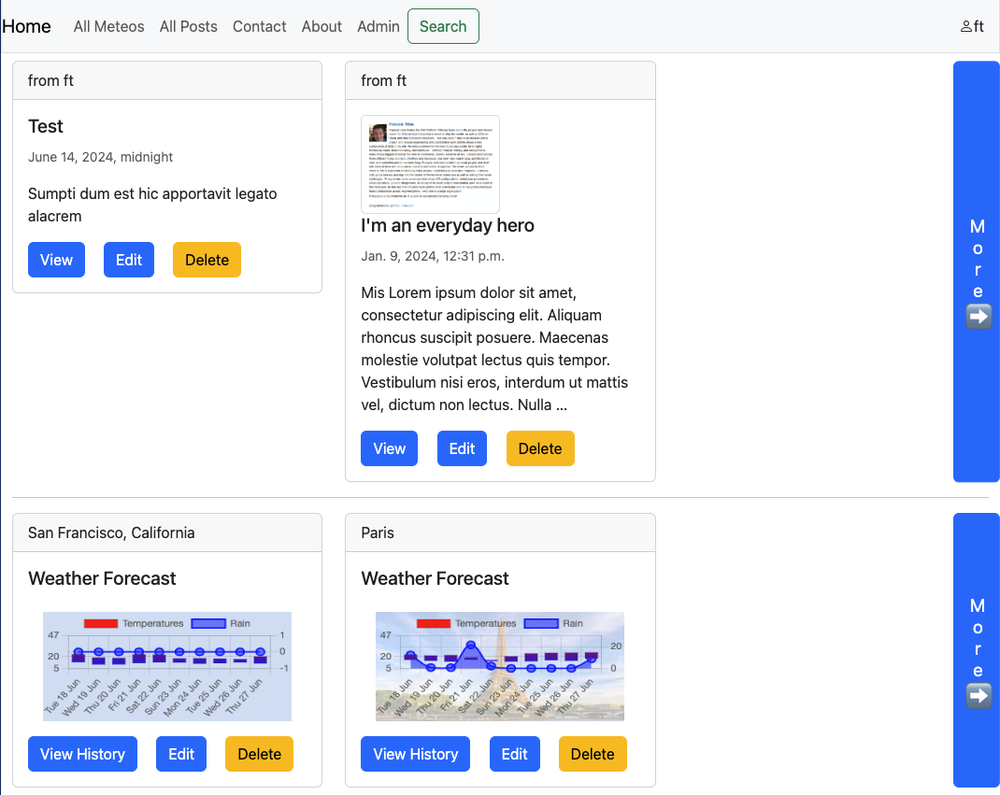

# Django and Python Exploration

1. Blog management application, with search queries ("hello world")
2. Weather history and prediction application  
  - Based on opencagedata.com geolocation and weather data
  - Includes map from OpenStreetMap
  - Includes charts
  - User profile to manage history and prediction duration
  - Also uses chart.js, JQuery and Bootstrap

## Configuration

This application requires the following environment variables to be set. Copy `.env.example` to `.env` and fill in your API keys:

```bash
cp .env.example .env
```

### Required Environment Variables:
- `SECRET_KEY`: Django secret key (used for security)
- `OPENCAGE_API_KEY`: API key from OpenCage Geocoding (https://opencagedata.com/)
- `WINDY_API_KEY`: API key from Windy (https://www.windy.com/webcams)
- `EMAIL_HOST_USER`: Email address for sending password reset emails
- `EMAIL_HOST_PASSWORD`: Password for the email account
- `GOOGLE_VISION_API_KEY` (optional): API key for Google Vision API

**Important**: Never commit the `.env` file to Git. The `.env` file is listed in `.gitignore`.
